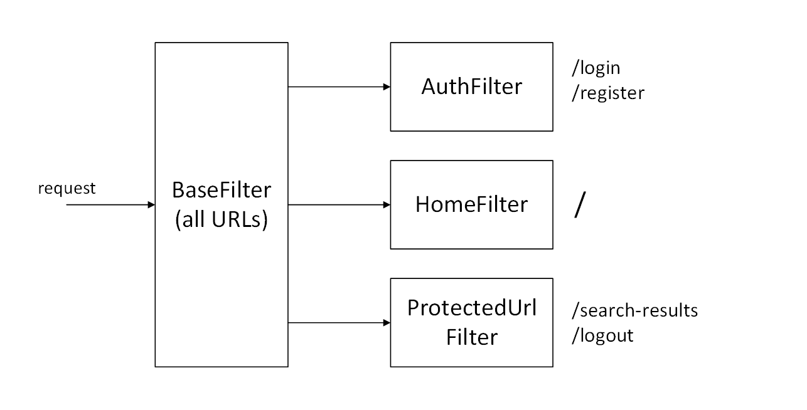

# Weather App

[](https://github.com/shinchik17/weather-app/actions/workflows/gradle-tests.yaml)
[](https://github.com/shinchik17/weather-app/actions/workflows/docker-build-push.yaml)


## Overview

A web application for viewing current weather. The user can register and add one or multiple locations (cities,
villages, or other places) to their collection. Afterward, the main page of the application will display a list of user
places with their current weather.

The technical requirements for this project can be found 
[here](https://zhukovsd.github.io/java-backend-learning-course/projects/weather-viewer/).


## Index

- [Technologies and frameworks used](#technologies-and-frameworks)
- [Application features](#application-features)
  - [1. User-related](#1-user-related)
  - [2. Location-related](#2-location-related)
  - [3. Developer-related](#3-developer-related)
- [Inteface overview](#interface-overview)
- [Implementation details](#implementation-details)
  - [1. Filters](#1-filters)
    - [1.1 BaseFilter](#11-basefilter)
    - [1.2 AuthFilter](#12-authfilter)
    - [1.3 ProtectedUrlFilter](#13-protectedurlfilter)
    - [1.4 HomeFilter](#14-homefilter)
  - [2. Servlets](#2-servlets)
    - [2.1 BaseServlet](#21-baseservlet)
    - [2.2 HomeServlet](#22-homeservlet)
    - [2.3 AuthServlets](#23-auth-servlets)
    - [2.4 SearchLocationServlet](#24-searchlocationservlet)
- [Deploy guide](#deploy-guide)
- [Acknowledgements](#acknowledgements)


## Technologies and frameworks
### Logic layer:
- **Jakarta EE (Servlet API)**: Provides a standard way to handle HTTP requests and responses.
- **JBCrypt**: OpenBSD-style Blowfish password hashing for Java

### Data access layer:
- **PostgresSQL**: A modern, powerful open source object-relational database system that uses and extends the SQL language combined
  with many features that safely store and scale the most complicated data workloads.
- **Hibernate**: A powerful framework for mapping an object-oriented domain model to a relational database.
- **HikariCP**: A connection pool that manages a pool of database connections, improving the performance of
  database operations by reusing connections rather than creating new ones for every request.
- **Flyway**: A simple database migration and version control tool.

### Frontend:
- **Thymeleaf**: A Java XML/XHTML/HTML5 template engine that serves for rendering pages on server side.
- **Bootstrap 5**: An open-source CSS framework directed at responsive, mobile-first front-end web development.
  It contains HTML, CSS and (optionally) JavaScript-based design templates.

### Testing:
- **JUnit 5**: A simple framework to write repeatable tests.
- **Mockito**: A mocking Java framework. It lets you write beautiful tests with a clean & simple API.
- **Testcontainers**: Testcontainers is an open source library for providing throwaway, lightweight instances of databases,
  message brokers, web browsers, or just about anything that can run in a Docker container.

### Deploy:
- **Tomcat**: A robust servlet container that implements the Servlet API. Tomcat serves as a web server and provides an
  environment where Java code can run.
- **Docker**: A tool for delivering software in packages called containers that. Uses OS-level virtualization.
- **Docker Compose**: An additional Docker tool for defining and running multi-container applications.
- **Watchtower**: A container-based solution for automating Docker container base image updates.
- **GitHub Actions**: A continuous integration and continuous delivery (CI/CD) platform that allows you to automate your build,
  test, and deployment pipeline.

### Monitoring:
- **Prometheus**: An open-source systems monitoring and alerting toolkit. In this project it is used in bundle with JMX Exporter.
- **JMX Exporter**: A collector that can configurable scrape and expose MBeans of a JMX target.
- **Grafana**: An open source analytics and interactive visualization web application. It can produce charts, graphs, and alerts
  for the web when connected to supported data sources.

### Miscellaneous:
- **ModelMapper & Jackson**: A suitable tools that simplify the task of mapping objects to each other.
- **Gradle**: A modern build automation tool used primarily for Java and Kotlin projects.
- **Lombok**: A java library that automatically plugs into your editor and build tools, spicing up your java.


## Application features

### 1. User-related:
- Registration
- Log in
- Log out
- Keeping user session in cookies

### 2. Location-related:
- Search location 
- Add location and its weather to favorite
- Remove location from favorites

### 3. Developer-related
- May stare at beautiful Grafana dashboards plots for hours


## Interface overview

The app contains five pages:
- Default (start page)
- Home (needs authorization)
- Log in
- Registration
- Search results (needs authorization)

They relate with each other as shown below.


Default and home page are placed on the same URL - application context path (by default is '/weather-app/').  
Log in and registration pages are inaccessible until user have active session.


## Implementation details


### 1. Filters
There are four HttpFilters used in project. Their relations are shown below.  



#### 1.1 BaseFilter
BaseFilter handles all requests to the application. It passes request to the
next filter if it has a valid servlet path, which are:
- "" (empty servlet path)
- /login
- /register
- /logout
- /search-results

BaseFilter redirect to the default page all requests which are not in list above.
Except requests to static resources. They are just going through filter.

#### 1.2 AuthFilter
This filter prevent authorized users with active session from 
navigating to registration or log in pages. It redirects such
requests to home page.

#### 1.3 ProtectedUrlFilter
ProtectedUrlFilter filter prohibit unauthorized users to go to 
search locations or log out. It redirects such requests
to default page.  

#### 1.4 HomeFilter
HomeFilter implement quite a similar function but only for 
empty servlet path (default and home page URL).  

The need for such separate filter is due to its servlet path. Empty servlet path cannot
be used as UrlPattern for filter (as we can do for "/search-results" and "/logout"),
because it is causes matching all requests (as well as BaseFilter does).  

That's why HomeFilter was implemented without using UrlPattern property, and it 
matches only the HomeServlet. HomeServlet handles both the default and 
home pages so logics of ProtectedUrlFilter and HomeFilter differs a little bit too. 


### 2. Servlets

#### 2.1 BaseServlet

Abstract parent class for all servlets. Encapsulate work with Thymeleaf engine
and some other common stuff.

#### 2.2 HomeServlet

Method doGet() serves for representing home page with location cards containing weather
for authorized users and default page for unauthorized users.  
Method doDelete() serves for removing location from user's tracking list.

#### 2.3 Auth servlets

Auth servlets is a group of servlets responsible for authentication. They are:
- AuthServlet - abstract class which implement common for Registration and LogIn servlets
exception handling
- RegistrationServlet - doGet() serves for representing page, doPost() handles registration
- LogInServlet - doGet() serves for representing page, doPost() handles signing in 
- LogOutServlet - doGet() ensures user signing out

#### 2.4 SearchLocationServlet

Method doGet() serves for representing page with location cards which were found 
by user entered search string.
Method doPost() serves for adding selected location to tracking list for locations 
which are shown on the home page.


## Deploy guide

Prerequisites:
- Docker: [Download Docker](https://www.docker.com/products/docker-desktop)

Installation:
1. Clone or download project
```shell
git clone https://github.com/shinchik17/weather-app.git
```

2. Navigate to the project directory
```shell
cd weather-app
```

3. Create file ".env" containing:
```
BCRYPT_SALT=
WEATHER_API_KEY=
DS_PASSWORD=
DS_URL='jdbc:postgresql://db:5432/postgres'
GRAFANA_PASS=
```

Where:
- BCRYPT_SALT is used for hashing user passwords (it may be generated [here](https://bcrypt-generator.com/))
- WEATHER_API_KEY is API-key for OpenWeatherMap service (you must generate it [here](https://home.openweathermap.org/api_keys))
- DS_PASSWORD is password for your postgres database
- DS_URL is database url (in case you may want to change it)
- GRAFANA_PASS is a password for Grafana monitoring dashboard

*It is better to add quotes at the edges of variables values, because some of them (BCRYPT_SALT to be precise)
could contain signs that may be interpreted wrong by shell.

4. Change prometheus password in web.yaml. It must be a bcrypt hash (it also may be generated [here](https://bcrypt-generator.com/)).
5. Ensure that ports 80, 3000, 9090 and 9001 are free on your local machine.
6. Run multi-container application by following command:

```shell
docker compose --env-file .env up -d
```
After that services will be accessible at:
- Weather tracker application - http://localhost/weather-app/
- JMX exporter info page - http://localhost:9001
- Prometheus - http://localhost:9090
- Grafana - http://localhost:3000

7. Configure Grafana dashboard.  
JMX exporter by default configured so that be compatible with
[this Apache Tomcat dashboard](https://grafana.com/grafana/dashboards/19532-apache-tomcat/).
So the easiest way is to import it by link or ID 19532.
Nevertheless, it is also possible to create your own custom dashboards and
panels using JMX metrics info at http://localhost:9001/metrics

8. Enjoy :D

*You may also change all used in docker containers ports. But it needs
a little bit more efforts. You need to:
- modify Dockerfile and build locally
- accordingly modify monitoring/prometheus/prometheus.yaml
- accordingly modify monitoring/grafana/datasource.yaml
- accordingly modify compose.yaml (not only ports but also image name of weather application image)
- remove watchtower from compose (because it would always replace your image with image from dockerhub)

## Acknowledgements

I would like to express my gratitude to [Sergey Zhukov](https://t.me/zhukovsd_it_mentor), 
the author of technical requirements, and [Aleksei Osadchii](https://github.com/aleos-dev), who
tested the application and reviewed the code.
